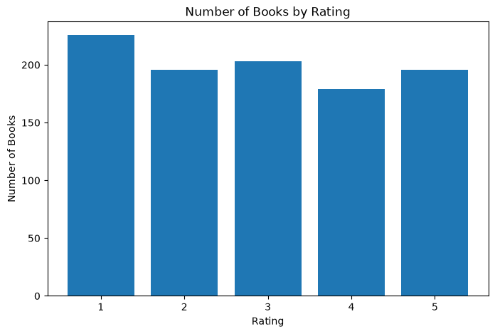
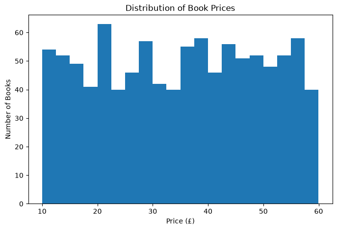
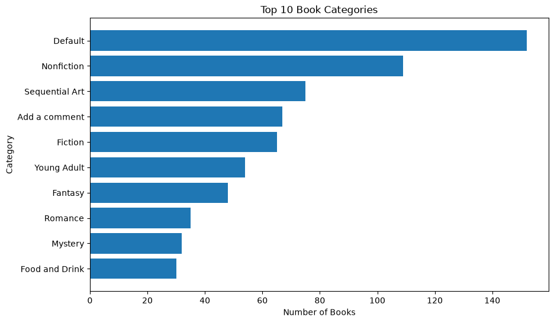
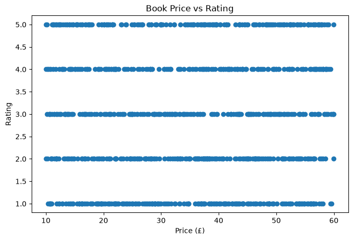
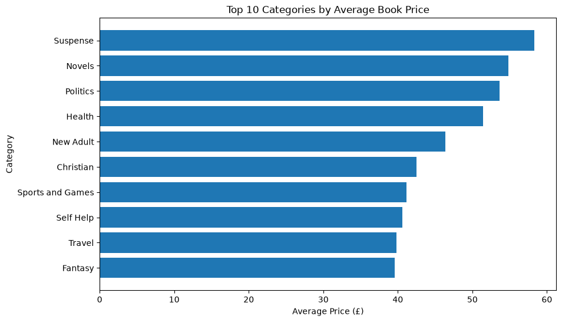

# Web Scraping and Book Price Analysis

## Project Overview

This project demonstrates an end-to-end data analysis workflow using web scraping.

The project collects book information from the Books to Scrape website, cleans the scraped data, performs exploratory data analysis, and creates visualizations to identify patterns in book prices, ratings, and categories.

## Objectives

- Scrape book data from multiple pages
- Collect book title, price, rating, category, availability, and product URL
- Clean and transform the scraped data
- Perform exploratory data analysis using Pandas
- Create visualizations using Matplotlib
- Identify relationships between book price and rating
- Analyze average prices across book categories

## Dataset

The dataset contains information for 1,000 books scraped across 50 pages.

### Columns

| Column | Description |
|---|---|
| title | Title of the book |
| price | Book price in pounds |
| rating | Book rating from 1 to 5 |
| category | Book category |
| availability | Availability status |
| product_url | URL of the individual book |

## Tools and Technologies

- Python
- Requests
- BeautifulSoup
- Pandas
- Matplotlib
- Jupyter Notebook
- VS Code

## Project Structure

```text
web-scraping-books/
│
├── data/
│   └── books.csv
│
├── src/
│   └── scraper.py
│
├── notebooks/
│   └── analysis.ipynb
│
├── README.md
├── requirements.txt
└── .gitignore


## Data Collection

The scraper uses Python Requests to send HTTP requests and BeautifulSoup to extract information from the website's HTML pages.

The scraper processes 50 catalogue pages and collects 20 books from each page, resulting in 1,000 book records.

## Data Cleaning

The following cleaning steps were performed:

- Converted prices from text to numeric values
- Converted ratings from text labels to numerical values
- Cleaned availability text
- Standardized unreliable category values as `Unknown`
- Removed duplicate records
- Checked for missing values

## Exploratory Data Analysis

The analysis includes:

- Price distribution
- Rating distribution
- Top book categories
- Price vs rating relationship
- Correlation between price and rating
- Average price by category
- Most expensive books
- Availability analysis

## Visualizations

### Rating Distribution



### Book Price Distribution



### Top 10 Book Categories



### Price vs Rating



### Top 10 Categories by Average Book Price



## Key Findings

- The dataset contains 1,000 books.
- The average book price is approximately £35.07.
- Book prices range from £10.00 to £59.99.
- The average book rating is approximately 2.92 out of 5.
- A 1-star rating is the most common rating, with 226 books.
- The correlation between price and rating is approximately 0.028, indicating almost no linear relationship.
- All 1,000 scraped books were listed as in stock.
- Suspense had the highest average price among the analyzed categories at approximately £58.33.
- The most expensive book was `The Perfect Play (Play by Play #1)` at £59.99.

## Limitations

- The source website is a practice/demo website created for web scraping.
- Category information contains some inconsistent values, which were standardized as `Unknown`.
- All scraped books were listed as in stock, so availability analysis is limited.
- The dataset represents the website at the time it was scraped and may change if the scraper is run again.

## How to Run the Project

### 1. Clone the repository

```bash
git clone <repository-url>
cd web-scraping-books

### 2. Install the required libraries

```bash
pip install -r requirements.txt

### 3. Run the web scraper

```bash
python src/scraper.py

